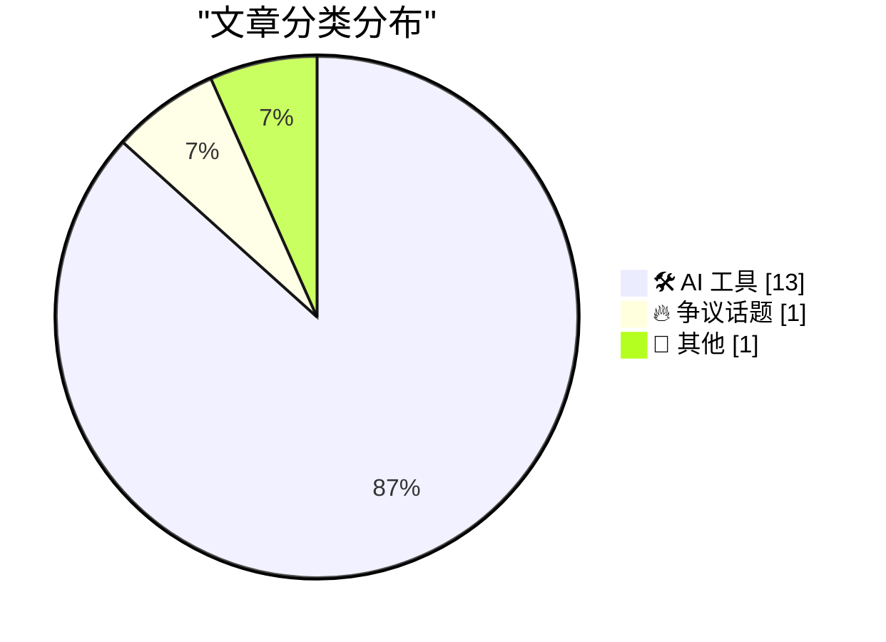
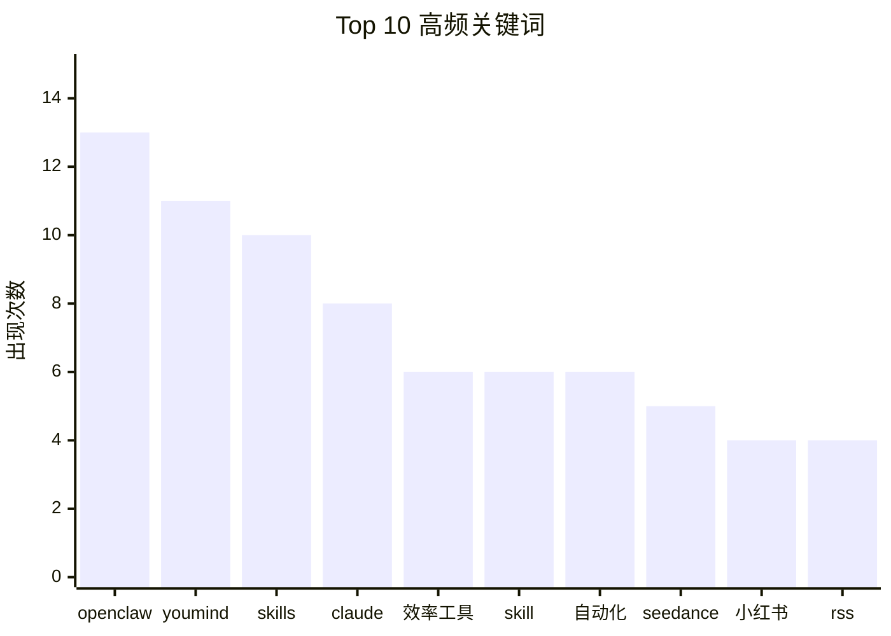

# 📰 书签日报 — 2026-02-18

> 来自 X 书签，AI 精选 Top 15

## 📝 今日看点

今日看点：AI工具持续涌现，赋能内容创作、工作流自动化和应用开发，大幅提升效率。同时，云部署方案简化，降低AI应用门槛，国产AI办公软件也在崛起，挑战现有格局。

---

## 🏆 今日必读

🥇 **小红书爆款内容一键生成！效率提升20倍？内容创作神器Skills大放送！**

[@stark_nico99](https://x.com/stark_nico99/status/2022321260584108257) · 🛠️ AI 工具 · ⭐ 11/15

> 开发者分享了一系列用于小红书内容创作的AI Skills，包括字幕提取、风格推文写作、爆款检测、图文生成等。

💡 **为什么值得关注**: 为小红书内容创作者提供了一套完整的AI辅助工具，可以显著提升创作效率。

🏷️ 小红书, 内容创作, AI工具, 效率工具, 文案生成

🥈 **一键订阅AI大神精选资讯：用YouMind打造你的专属AI信息简报！**

[@jaredliu_bravo](https://x.com/jaredliu_bravo/status/2021952323237687527) · 🛠️ AI 工具 · ⭐ 11/15

> 该推文介绍了一个使用YouMind工具，将Karpathy大佬推荐的RSS信源打包并自动生成信息简报的方案，方便用户获取高质量AI资讯。

💡 **为什么值得关注**: 可以帮助用户高效获取AI领域高质量信息，节省筛选时间，提升信息获取效率。

🏷️ RSS, 信息简报, 自动化, Karpathy

🥉 **快速构建AI应用：Vercel推出AI Elements组件库，对话、消息组件一应俱全！**

[@op7418](https://x.com/op7418/status/2018877411904077913) · 🛠️ AI 工具 · ⭐ 11/15

> 该推文介绍了Vercel推出的AI Elements组件库，该组件库基于shadcn/ui构建，提供了AI应用常见的对话、消息等组件。

💡 **为什么值得关注**: AI应用开发者可以利用该组件库快速搭建界面，提高开发效率，值得关注。

🏷️ AI Chat, Agent, 组件库, shadcn/ui, vercel

---

## 📊 数据概览

| 扫描推文 | 筛选后 | 精选 |
|:---:|:---:|:---:|
| 33 条 | 33 条 | **15 条** |

### 分类分布



### 高频关键词



<details>
<summary>📈 纯文本关键词图（终端友好）</summary>

```
openclaw │ ████████████████████ 13
youmind  │ █████████████████░░░ 11
skills   │ ███████████████░░░░░ 10
claude   │ ████████████░░░░░░░░ 8
效率工具     │ █████████░░░░░░░░░░░ 6
skill    │ █████████░░░░░░░░░░░ 6
自动化      │ █████████░░░░░░░░░░░ 6
seedance │ ████████░░░░░░░░░░░░ 5
小红书      │ ██████░░░░░░░░░░░░░░ 4
rss      │ ██████░░░░░░░░░░░░░░ 4
```

</details>

### 🏷️ 话题标签

**openclaw**(4) · **效率工具**(3) · **自动化**(3) · 小红书(2) · ai agent(2) · 内容创作(1) · ai工具(1) · 文案生成(1) · rss(1) · 信息简报(1) · karpathy(1) · ai chat(1) · agent(1) · 组件库(1) · shadcn/ui(1) · vercel(1) · claude(1) · ai工作流(1) · 编程(1) · cloudflare(1)

---

## 🛠️ AI 工具

### 1. 小红书爆款内容一键生成！效率提升20倍？内容创作神器Skills大放送！

[@stark_nico99](https://x.com/stark_nico99/status/2022321260584108257) · ⭐ 11/15 · ❤️ 625 · 🔄 180 · 💬 15

> 开发者分享了一系列用于小红书内容创作的AI Skills，包括字幕提取、风格推文写作、爆款检测、图文生成等。

💡 为小红书内容创作者提供了一套完整的AI辅助工具，可以显著提升创作效率。

🏷️ 小红书, 内容创作, AI工具, 效率工具, 文案生成

---

### 2. 一键订阅AI大神精选资讯：用YouMind打造你的专属AI信息简报！

[@jaredliu_bravo](https://x.com/jaredliu_bravo/status/2021952323237687527) · ⭐ 11/15 · ❤️ 315 · 🔄 62 · 💬 17

> 该推文介绍了一个使用YouMind工具，将Karpathy大佬推荐的RSS信源打包并自动生成信息简报的方案，方便用户获取高质量AI资讯。

💡 可以帮助用户高效获取AI领域高质量信息，节省筛选时间，提升信息获取效率。

🏷️ RSS, 信息简报, 自动化, Karpathy

---

### 3. 快速构建AI应用：Vercel推出AI Elements组件库，对话、消息组件一应俱全！

[@op7418](https://x.com/op7418/status/2018877411904077913) · ⭐ 11/15 · ❤️ 101 · 🔄 20 · 💬 4

> 该推文介绍了Vercel推出的AI Elements组件库，该组件库基于shadcn/ui构建，提供了AI应用常见的对话、消息等组件。

💡 AI应用开发者可以利用该组件库快速搭建界面，提高开发效率，值得关注。

🏷️ AI Chat, Agent, 组件库, shadcn/ui, vercel

---

### 4. 3分钟搭建永续AI工作系统？大神教你用Claude Code实现AI工作流自动化！

[@Roland_WayneOZ](https://x.com/Roland_WayneOZ/status/2018946199106326726) · ⭐ 10/15 · ❤️ 2,005 · 🔄 525 · 💬 67

> 文章介绍了如何使用Claude Code在3分钟内搭建一套可迭代的永续AI工作系统，实现工作流程自动化。

💡 展示了AI在工作流程自动化方面的应用，为用户提供了一种构建个性化AI工作系统的新思路。

🏷️ Claude, AI工作流, 自动化, 编程, 效率工具

---

### 5. 告别云服务器部署烦恼：Cloudflare免费云部署方案，新手也能轻松上手！

[@seekjourney](https://x.com/seekjourney/status/2018887028776276193) · ⭐ 10/15 · ❤️ 331 · 🔄 76 · 💬 9

> 该推文推荐了Cloudflare自带Zero Trust保护的云部署方案，并表示有详细的保姆级教程，适合新手用户。

💡 为纠结于云服务器部署的新手用户提供了一个简单省心的解决方案。

🏷️ Cloudflare, 云部署, Zero Trust, OpenClaw

---

### 6. OpenClaw进化！AI语音平台+电话接入，打造可拨打电话的AI代理！

[@zstmfhy](https://x.com/zstmfhy/status/2018871162089157053) · ⭐ 10/15 · ❤️ 160 · 🔄 32 · 💬 6

> OpenClaw现在可以通过AI音频平台构建可拨打电话的AI代理，支持双向语音对话，并整合ElevenLabs的语音引擎。

💡 展示了AI Agent在语音交互方面的最新进展，为用户提供了新的应用思路。

🏷️ OpenClaw, AI Agent, 语音交互, ElevenLabs

---

### 7. 挑战Claude Cowork！天工推出对标产品，国产AI办公软件崛起？

[@oran_ge](https://x.com/oran_ge/status/2019201553475989575) · ⭐ 10/15 · ❤️ 148 · 🔄 22 · 💬 11

> 天工推出了对标Claude Cowork的产品，旨在为国内用户提供更友好的AI办公体验。

💡 关注国产AI办公软件的发展，为用户提供更多选择。

🏷️ Claude Cowork, 天工, 国产替代, AI办公

---

### 8. X书签整理神器：OpenClaw插件一键安装，还能提供创作灵感！

[@sodawhite_dev](https://x.com/sodawhite_dev/status/2017486487605174643) · ⭐ 10/15 · ❤️ 208 · 🔄 47 · 💬 13

> 该推文推荐了一款OpenClaw插件，可以整理X书签并根据收藏内容提供创作建议，并提供了详细的安装步骤。

💡 如果你是X平台重度用户，并且已经在使用OpenClaw，这个插件能极大提升你的信息管理和创作效率。

🏷️ OpenClaw, AI插件, 效率工具, 书签管理, 创作辅助

---

### 9. 睡不着？试试用Gemini帮你梳理人生，解开困惑！

[@430Yang](https://x.com/430Yang/status/2023427384343769139) · ⭐ 9/15 · ❤️ 3,160 · 🔄 463 · 💬 30

> 用户可以通过与Gemini分享个人信息，获取短期、中期和长期建议，从而理清思路，解决困惑。

💡 提供了一种低成本、易操作的自我分析方法，帮助用户利用AI解决实际问题。

🏷️ Gemini, AI助手, 个人成长, 问题解决

---

### 10. 告别低效！Claude Code实战教程：两步教你提升编程效率

[@vikingmute](https://x.com/vikingmute/status/2023027903269851452) · ⭐ 9/15 · ❤️ 1,596 · 🔄 379 · 💬 21

> 作者总结了Claude Code的两个实用技巧：先用Plan Mode进行规划，然后创建并维护一个。

💡 提供了Claude Code的实用技巧，可以帮助开发者提升编程效率。

🏷️ Claude Code, AI编程, 实战教程, 技巧

---

### 11. 告别提示词焦虑！字节Seedance 2.0提示词Skill开源，轻松生成高质量视频

[@songguoxiansen](https://x.com/songguoxiansen/status/2022118221084848429) · ⭐ 9/15 · ❤️ 1,092 · 🔄 256 · 💬 32

> 开发者开源了一款专为字节Seedance 2.0模型开发的Skill，可以通过自然语言描述生成高质量视频提示词。

💡 为特定AI视频生成模型提供提示词优化方案，或能启发其他类似工具的开发。

🏷️ Seedance, 提示词, 视频生成, 开源

---

### 12. 解放打工人？试试把你的工作交给AI Agent OpenClaw，逐步实现自动化！

[@Jackywine](https://x.com/Jackywine/status/2019219264839028959) · ⭐ 9/15 · ❤️ 11 · 🔄 0 · 💬 3

> 作者建议将日常工作逐步交给OpenClaw这样的全天候AI Agent，即使不能完全替代，也能解放一部分精力。

💡 提供了一种AI Agent的实用思路，帮助用户探索如何利用AI提高工作效率。

🏷️ OpenClaw, AI Agent, 自动化

---

### 13. 懒人福音！一行命令部署AI助理，告别繁琐配置！

[@ivanvolt815](https://x.com/ivanvolt815/status/2019057522762780825) · ⭐ 9/15 · ❤️ 233 · 🔄 73 · 💬 2

> 推荐OpenClawInstaller，可以一键部署ClawdBot，简化了AI助理的部署流程。

💡 降低了AI助理的使用门槛，让更多人可以轻松体验AI的便利。

🏷️ AI助理, 一键部署, ClawdBot

---

## 🔥 争议话题

### 14. 如何让AI写作更像人？小红书“去AI味”笔记过万，宝玉老师教你摆脱AI痕迹

[@dotey](https://x.com/dotey/status/2022774029220749538) · ⭐ 9/15 · ❤️ 0 · 🔄 263 · 💬 54

> 小红书上大量用户搜索“去AI味”，反映了AI写作内容同质化的问题。文章探讨了如何去除AI写作的痕迹。

💡 揭示了AI内容生成的一个重要挑战：如何提升内容质量，使其更具人性化。

🏷️ AI写作, 内容优化, 小红书, 文案

---

## 📌 其他

### 15. AI掘金时代：零基础也能上手！这份AI副业赚钱攻略请收好！

[@seclink](https://x.com/seclink/status/2019639655642329318) · ⭐ 9/15 · ❤️ 134 · 🔄 26 · 💬 3

> 该推文分享了一份AI副业赚钱攻略，旨在帮助用户利用AI技术赚取额外收益，并提供了英文版本。

💡 对于想了解AI变现途径的普通用户来说，这份攻略提供了一些入门思路和方向。

🏷️ AI副业, 赚钱, 变现

---

## 💡 选题思路

1. **AI帮你搞钱？零基础也能学会的AI副业攻略，轻松开启你的掘金之路！**
   角度: 聚焦普通用户最关心的“赚钱”话题，结合AI副业攻略，吸引用户关注。
   素材来源: 推文 #13

2. **告别“AI味”！小红书爆火的“去AI感”技巧，让你的内容更真实有趣！**
   角度: 抓住小红书用户对AI写作内容同质化的痛点，提供解决方案，引发共鸣。
   素材来源: 推文 #1, #12

3. **Gemini化身人生导师？睡不着就找它聊聊，帮你理清思路、解开人生困惑！**
   角度: 强调Gemini的实用性和情感价值，吸引有生活困惑的用户尝试。
   素材来源: 推文 #9

4. **AI工作流自动化：3分钟搭建永续AI系统，让Claude Code帮你解放双手！**
   角度: 强调AI工作流的便捷性和效率提升，吸引职场人士关注。
   素材来源: 推文 #4, #10

5. **AI电话代理来了！OpenClaw升级，打造你的专属AI客服，24小时在线！**
   角度: 突出AI电话代理的实用性和创新性，吸引对AI应用感兴趣的用户。
   素材来源: 推文 #6, #14, #15

---

*生成于 2026-02-18 04:55 | 扫描 33 条 → 精选 15 条*
*由「懂点儿AI」制作，欢迎关注同名微信公众号获取更多 AI 实用技巧 💡*
