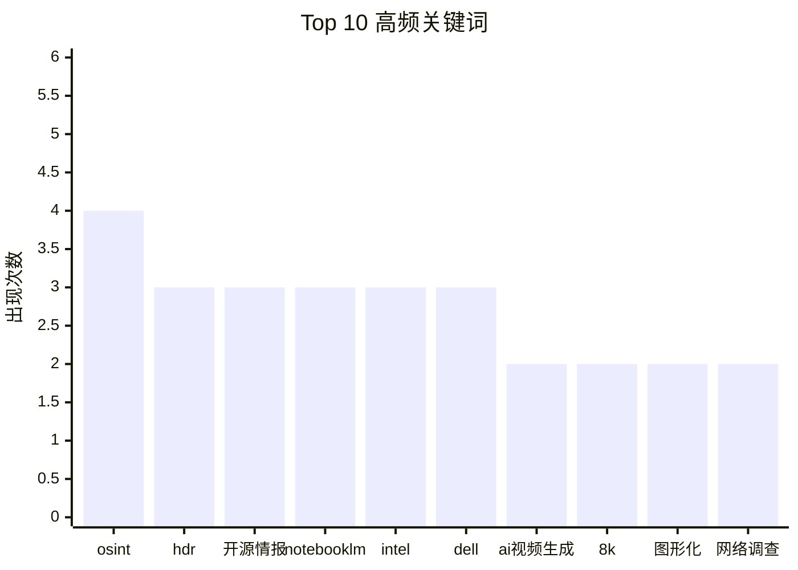

# AI 选题报告 - 2026-02-01

## 摘要
- **扫描推文**: 15
- **筛选后**: 15
- **推荐选题**: 5

---

## 🔥 互动热度 Top 3

| 排名 | 作者 | 互动总量 | 内容预览 | 链接 |
|------|------|----------|----------|------|
| 1 | @TinaLearning | 687 | 告别低效阅读！11个NotebookLM提示词，让你的文档秒变专属课程！... | [🔗](https://x.com/TinaLearning/status/2017541370513395995) |
| 2 | @Neuravision_A | 683 | AI视频新纪元：Neuravision发布电影级8K视频生成工具！... | [🔗]() |
| 3 | @berryxia | 47 | 告别云端！LM Studio：在Mac上轻松运行大型语言模型的秘密武器... | [🔗](https://x.com/berryxia/status/2017616760346976322) |

---

## 📊 关键词词频统计

| 关键词 | 出现次数 |
|--------|----------|
| osint | 4 |
| hdr | 3 |
| 开源情报 | 3 |
| notebooklm | 3 |
| intel | 3 |
| dell | 3 |
| ai视频生成 | 2 |
| 8k | 2 |
| 图形化 | 2 |
| 网络调查 | 2 |

---

## Top 5 选题推荐

### 1. AI视频新纪元：Neuravision发布电影级8K视频生成工具！

**作者**: @Neuravision_A (Neuravision App) | **分类**: 行业新闻

**AI 评分**: 11/15
- 🎯 创新性: 4/5 - AI视频生成领域的新进展，8K HDR视频是亮点。
- 💡 实用性: 3/5 - 虽然效果惊艳，但普通用户可能需要一定的硬件和软件基础。
- 📈 影响力: 4/5 - AI视频生成是重要发展方向，值得关注。

**AI 摘要**:
> Neuravision发布新AI视频生成工具，可生成高达60秒的8K HDR视频，效果惊艳。

**原文内容**:
> A new era of AI video starts here!
> Produce cinematic 8K videos up to 60 seconds with HDR and advanced hybrid intelligence.
> Less friction. More speed. Hollywood-style results.

**中文翻译**:
> AI视频的新时代从这里开始！
> 使用HDR和先进的混合智能制作长达60秒的电影级8K视频。
> 减少摩擦。提高速度。好莱坞风格的结果。

**互动数据**: ❤️ 555 | 🔄 67 | 💬 61 | 👀 640,782
**发布时间**:  | 🔗 [查看原帖]()
**标签**: 原创 | AI视频生成 | 8K | HDR

---

### 2. 网络安全必备：开源OSINT图形化工具，社交媒体也能搜个底朝天！

**作者**: @QingQ77 (Geek Lite) | **分类**: AI 工具

**AI 评分**: 11/15
- 🎯 创新性: 4/5 - 开源的图形化OSINT工具，支持多种数据源，具有一定创新性。
- 💡 实用性: 4/5 - 对于需要进行网络调查的用户来说非常实用，易于上手。
- 📈 影响力: 3/5 - OSINT工具在特定领域有一定影响力。

**AI 摘要**:
> 一款开源的图形化OSINT工具，支持多种数据源，可用于网络调查、透明度验证等。

**原文内容**:
> OSINT界的瑞士军刀 专门搞图形化调查
> 支持各种 enricher，从域名到IP，从加密钱包到NFT，连社交媒体都能搜个底朝天
> 
> 一个开源的OSINT（开源情报）图形探索工具，专注于道德调查、透明度和验证。它采用图形界面，允许用户通过视觉方式探索实体之间的关系，并利用自动化 enrichers（增强器）来处理数据

**中文翻译**:
> OSINT界的瑞士军刀 专门搞图形化调查
> 支持各种 enricher，从域名到IP，从加密钱包到NFT，连社交媒体都能搜个底朝天
> 
> 一个开源的OSINT（开源情报）图形探索工具，专注于道德调查、透明度和验证。它采用图形界面，允许用户通过视觉方式探索实体之间的关系，并利用自动化 enrichers（增强器）来处理数据

**互动数据**: ❤️ 26 | 🔄 6 | 💬 0 | 👀 1,983
**发布时间**: 2026-02-01T05:43:06.000Z | 🔗 [查看原帖](https://x.com/QingQ77/status/2017836081237135742)
**标签**: 原创 | OSINT | 开源情报 | 图形化 | 网络调查

---

### 3. 告别低效阅读！11个NotebookLM提示词，让你的文档秒变专属课程！

**作者**: @TinaLearning (边忘边学的Tina) | **分类**: 教程指南

**AI 评分**: 10/15
- 🎯 创新性: 3/5 - 利用NotebookLM进行学习，方法实用，但提示词需要进一步探索。
- 💡 实用性: 4/5 - NotebookLM使用技巧，对于需要处理大量文档的用户有帮助。
- 📈 影响力: 3/5 - NotebookLM是Google的产品，具有一定影响力。

**AI 摘要**:
> 分享使用NotebookLM从文档和笔记中高效学习的技巧，提供11个实用提示词。

**原文内容**:
> 我停止了从头到尾阅读书籍和PDF的浪费时间行为。
> 
> 现在我用NotebookLM直接从文档和笔记中学习。
> 
> 这里有11个提示词能将文件转变成真正的课程：

**互动数据**: ❤️ 403 | 🔄 155 | 💬 129 | 👀 60,196
**发布时间**: 2026-01-31T10:12:01.000Z | 🔗 [查看原帖](https://x.com/TinaLearning/status/2017541370513395995)
**标签**: 原创 | NotebookLM | 学习技巧 | 效率提升

---

### 4. 告别云端！LM Studio：在Mac上轻松运行大型语言模型的秘密武器

**作者**: @berryxia (Berryxia.AI) | **分类**: AI 工具

**AI 评分**: 10/15
- 🎯 创新性: 3/5 - 介绍了LM Studio在MacOS MLX框架下的应用，对于寻找本地LLM客户端的用户有一定参考价值。
- 💡 实用性: 4/5 - LM Studio易于上手，可以直接输入模型名称使用，方便用户进行本地LLM调用。
- 📈 影响力: 3/5 - LM Studio作为开源本地LLM客户端，在开发者和部分用户群体中具有一定影响力。

**AI 摘要**:
> 推文介绍了LM Studio，一个开源本地LLM客户端，尤其适用于MacOS MLX框架模型，方便用户进行本地LLM调用。

**原文内容**:
> 很多人可能使用过CherryStudio，但是不一定认识LM Studio，其实这个开源本地LLM客户端更大的程度上使用Macos MLX 框架模型的最佳工具。
> 
> 我们在给客户做一些演示case调用的时候都是使用LM Studio来完成，当然也是支持GGUF，直接输入模型名称即可。
> 
> 这个最新版本将于Claude Code

**互动数据**: ❤️ 39 | 🔄 4 | 💬 4 | 👀 10,321
**发布时间**: 2026-01-31T15:11:35.000Z | 🔗 [查看原帖](https://x.com/berryxia/status/2017616760346976322)
**标签**: 原创 | LM Studio | 本地LLM | MacOS MLX | 开源

---

### 5. 戴尔发布新款AI PC：英特尔酷睿Ultra加持，生产力加速！

**作者**: @Dell_JPN (Dell Technologies Japan) | **分类**: 行业新闻

**AI 评分**: 9/15
- 🎯 创新性: 3/5 - 英特尔新芯片加持的AI PC，属于常规产品更新。
- 💡 实用性: 3/5 - 对想购买AI PC的用户有参考价值，但需要进一步了解配置和价格。
- 📈 影响力: 3/5 - 戴尔作为知名厂商，其产品更新值得关注。

**AI 摘要**:
> 戴尔日本发布搭载英特尔酷睿Ultra的新款AI PC，强调其在多任务处理方面的强大性能。

**原文内容**:
> Intel Core Ultra 搭載の新しい Dell AI PC。あなたの力を加速する高い生産性で、マルチタスクがもっとスムーズに、もっと速く。

**中文翻译**:
> Intel Core Ultra 搭載の新しい Dell AI PC。あなたの力を加速する高い生産性で、マルチタスクがもっとスムーズに、もっと速く。
> 
> 翻译：搭载英特尔酷睿Ultra的新款戴尔AI PC。以加速您能力的高生产力，让多任务处理更流畅、更快。

**互动数据**: ❤️ 28 | 🔄 0 | 💬 0 | 👀 1,101,248
**发布时间**:  | 🔗 [查看原帖]()
**标签**: 原创 | AI PC | Intel | Dell | 硬件

---

